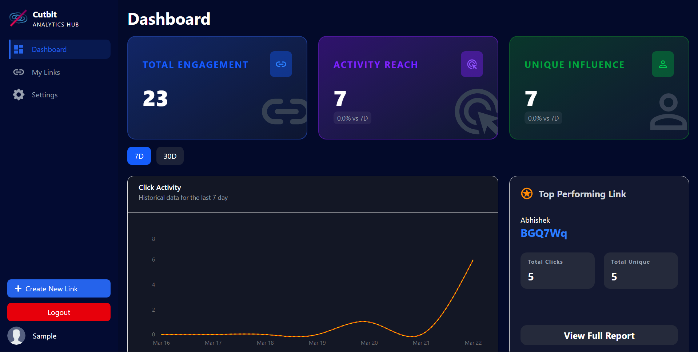
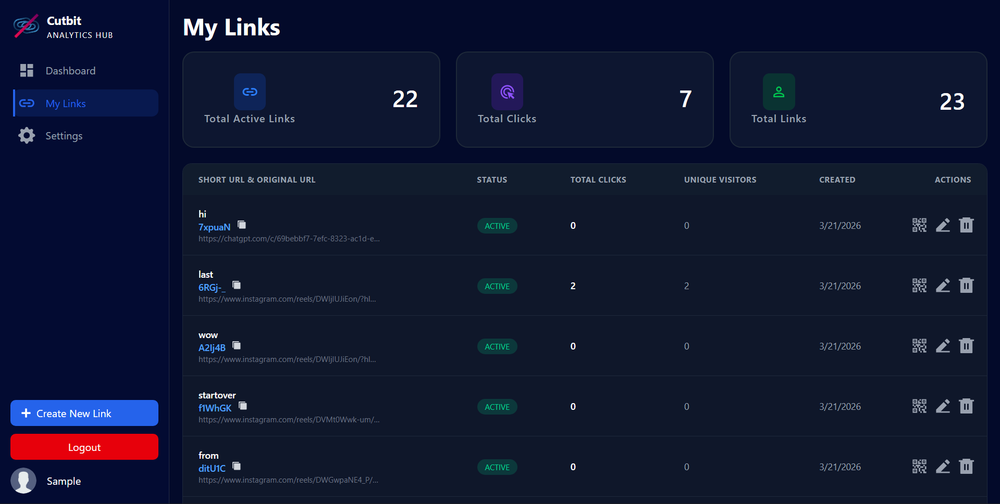
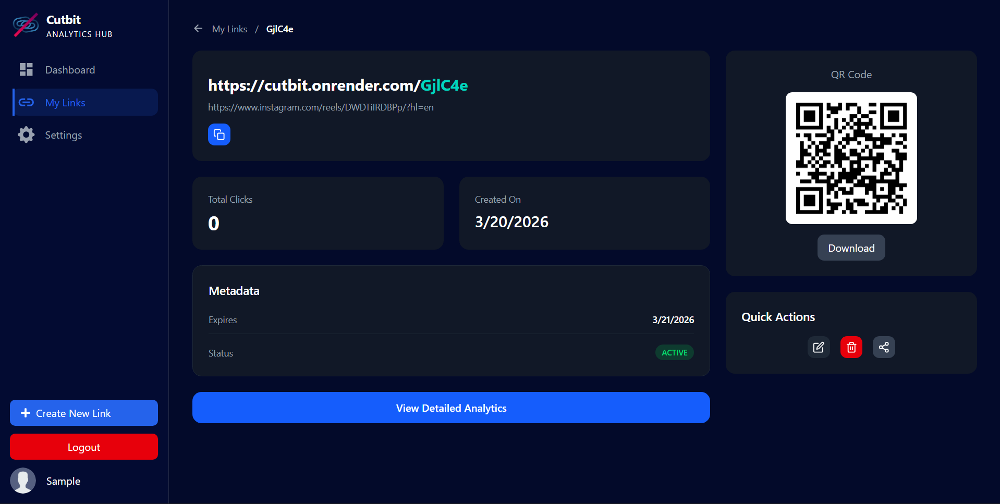
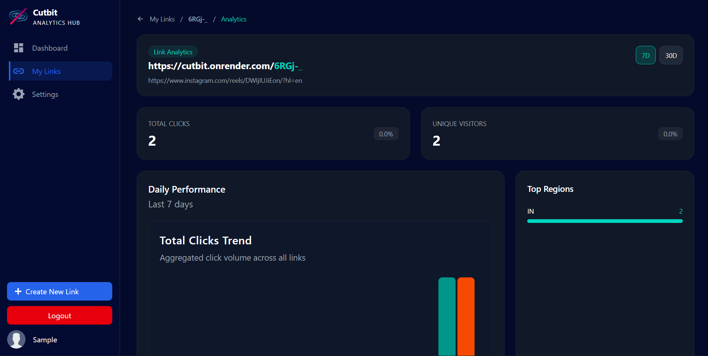

# 🔗 Cutbit

A full-stack URL shortener built with the MERN stack, designed for developers and marketers who want more than just short links — real analytics, performance insights, and clean architecture.

Cutbit focuses on **near real-time analytics**, **scalable data tracking**, and **performance-optimized frontend fetching using React Query**.

---

## 🚀 Live Demo

👉 [https://cutbit.vercel.app/](https://cutbit.vercel.app/)

---

## ⚙️ Tech Stack

### Frontend

* React (Vite)
* Tailwind CSS
* React Router
* React Query

### Backend

* Node.js
* Express.js
* MongoDB (Mongoose)

### Other Tools

* geoip-lite (geolocation tracking)
* ua-parser-js (device & browser detection)
* Google OAuth (authentication)

---

## ✨ Features

### 🔗 Core Functionality

* Create short URLs from long links
* Custom aliases for links
* Share links or QR codes instantly

### 🔍 Link Analytics

* Track total clicks and unique visitors for each link
* View performance over time with daily time-based tracking (7D / 30D)
* Timezone-consistent analytics aggregation (IST-based)
* See which devices users are coming from (mobile, desktop, tablet)
* Identify traffic sources (referrer tracking)
* Understand audience location (country-level data)
* Complete performance breakdown with click & unique visitor trends, device insights, referrer sources, and geographic data

### 📈 Dashboard

* Centralized dashboard for all links
* Growth trends visualization

### 🔐 Authentication

* JWT-based authentication
* Email & password login
* Google OAuth login
* Protected routes
* User-specific data isolation
* Secure password hashing

---

## 📸 Screenshots

### Dashboard


### My Links


### Link Details


### Link Analytics


---

## ⚙️ How Cutbit Works

1. User creates a short link mapped to an original URL  
2. When a short link is accessed:
   - Request is validated (expiry, status)
   - Bot traffic is filtered using user-agent + headers
   - A visitor ID is assigned using cookies (visitorId)
   - Device, country, and referrer are extracted
   - Click and visitor data are recorded and aggregated per day
3. User is redirected to the original URL

---

## 📊 Analytics Approach

- Click tracking is request-based (each valid request increments count)
- Bot traffic is filtered using user-agent and request header checks
- Unique visitors are tracked using cookies with daily deduplication
- Device type is derived from user-agent parsing
- Referrer data is normalized to remove internal traffic noise
- Country-level data is estimated using GeoIP lookup
- Analytics are grouped using a consistent timezone (IST) to ensure accurate daily aggregation and chart alignment

---

## 🏗️ Architecture

Client (React) → API (Express) → MongoDB

- Redirect route handles validation, bot filtering, and analytics tracking in a single request cycle  
- Visitor data is stored separately to track unique visits using cookies  
- Analytics are aggregated per day for efficient querying and chart rendering  
- Frontend uses React Query for optimized data fetching and caching

---

## ⚡ Setup Instructions

### 1. Clone Repository

```bash
git clone https://github.com/abhirawat03/Cutbit.git
cd cutbit
```

### 2. Install Dependencies

#### Frontend

```bash
cd client
npm install
npm run dev
```

#### Backend

```bash
cd server
npm install
npm run dev
```

---

## 🔐 Environment Variables

### Backend (.env)

```env
PORT=8000
DB_NAME=
MONGODB_URL=

ACCESS_TOKEN_SECRET=
ACCESS_TOKEN_EXPIRY=
REFRESH_TOKEN_SECRET=
REFRESH_TOKEN_EXPIRY=

CLOUDINARY_CLOUD_NAME=
CLOUDINARY_API_KEY=
CLOUDINARY_API_SECRET=

GOOGLE_CLIENT_ID=
GOOGLE_CLIENT_SECRET=

FRONTEND_URL=
BACKEND_URL=
```

### Frontend (.env)

```env
VITE_BACKEND_URL=
```

---

## 📁 Project Structure

```
client/
  src/
    components/
    pages/
    hooks/
    services/
    context/
    providers/
    lib/
    assets/
    api/
    App.jsx
    main.jsx

server/
  src/
    controllers/
    routes/
    models/
    middleware/
    config/
    db/
    utils/
    app.js
    index.js
```

---

## 🚀 Deployment

* Frontend: Vercel
* Backend: Render
* Database: MongoDB Atlas

---

## ⚠️ Notes / Limitations

- Analytics are near real-time but not streaming (depends on request frequency)
- Bot traffic is filtered using heuristics (user-agent + headers) and may not be perfect
- Unique visitors are cookie-based and may be slightly inflated due to browser/device differences
- Geo-location is IP-based and may be inaccurate for VPN/proxy users
- Free-tier backend (Render) may experience cold starts
- Analytics currently use a fixed timezone (IST); global timezone support is not yet implemented
---

## 🧑‍💻 Author

Abhishek Rawat

---

If you find this project useful, consider giving it a ⭐ on GitHub.
